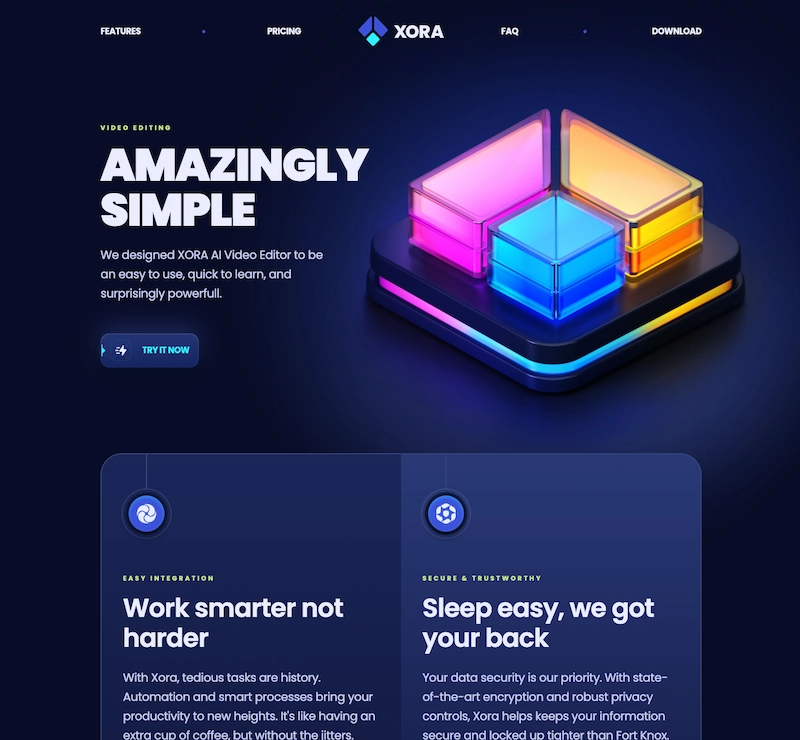

<div align="center">
  <br />
  <br />
  
  # <code>XORA_APP</code>
  
  **REACT + TAILWIND STATIC LANDING PAGE EXPERIMENT**
  
  <br />

  
  
  

  <br />
  <br />
</div>

---

### 00 __ PREVIEW



> **ABSTRACT:** Landing page moderna con secciones de características, pricing, testimonios y FAQ. Implementación de componentes reutilizables con React y estilizado responsivo con Tailwind CSS.
>
> <br />
>
> **ORIGIN:** Based on [React & Tailwind Course](https://www.jsmastery.pro/) by [JS Mastery](https://www.jsmastery.pro/).
> *Adapted for personal training and practice.*
>
> <br />
>
> **DEMO:** [xora-app-liard.vercel.app](https://xora-app-liard.vercel.app/)

---

### 01 __ ARCHITECTURE & DECISIONS

| COMPONENT | TECH | NOTE |
| :--- | :--- | :--- |
| **Core** | `React 18` | Modern component-based architecture. |
| **Styles** | `Tailwind CSS` | Utility-first CSS framework. |
| **Build Tool** | `Vite` | Fast development server and optimized builds. |
| **Linting** | `ESLint` | Code quality enforcement. |

<br>

### 02 __ INSTALLATION

*Run local environment:*

```bash
# 1. Clone
git clone https://github.com/samuhlo-training/xora-app.git

# 2. Navigate
cd xora-app

# 3. Install dependencies (pnpm enforced)
pnpm install

# 4. Ignite
pnpm dev
```

### 03 __ KEY FEATURES / SNIPPETS

Componentes destacados de este experimento:

#### A. REUSABLE BUTTON COMPONENT
Sistema de botones reutilizable con variantes dinámicas.

```jsx
// components/Button.jsx
const Button = ({ icon, children, href, containerClassName, onClick, markerFill }) => {
  const Inner = () => (
    <>
      <span className="relative flex items-center min-h-[60px] px-4 g4 rounded-2xl inner-before group-hover:before:opacity-100 overflow-hidden">
        <span className="absolute -left-[1px]">
          <Marker markerFill={markerFill} />
        </span>
        {icon && (
          
        )}
        <span className="relative z-2 font-poppins base-bold text-p1 uppercase">
          {children}
        </span>
      </span>
      <span className="glow-before glow-after" />
    </>
  );

  return href ? (
    <a className={`relative p-0.5 g5 rounded-2xl shadow-500 group ${containerClassName}`} href={href}>
      <Inner />
    </a>
  ) : (
    <button className={`relative p-0.5 g5 rounded-2xl shadow-500 group ${containerClassName}`} onClick={onClick}>
      <Inner />
    </button>
  );
};
```

#### B. FAQ ACCORDION SYSTEM
Sistema de acordeón dinámico con transiciones suaves usando Framer Motion.

```jsx
// components/FaqItem.jsx
const FaqItem = ({ item, index }) => {
  const [activeId, setActiveId] = useState(null);
  const active = activeId === item.id;

  return (
    <div className="relative z-2 mb-16">
      <div
        className="group relative flex cursor-pointer items-center justify-between gap-10 px-7"
        onClick={() => {
          setActiveId(activeId === item.id ? null : item.id);
        }}
      >
        <div className="flex-1">
          <div className="small-compact mb-1.5 text-p3 max-lg:hidden">
            {index < 10 ? "0" : ""}
            {index}
          </div>
          <div
            className={clsx(
              "h6 text-p4 transition-colors duration-500 max-md:flex max-md:min-h-20 max-md:items-center",
              active && "max-lg:text-p1"
            )}
          >
            {item.question}
          </div>
        </div>

        <div
          className={clsx(
            "faq-icon relative flex size-12 items-center justify-center rounded-full border-2 border-s2 shadow-400 transition-all duration-500 group-hover:border-s4",
            active && "before:bg-p1 after:rotate-0 after:bg-p1"
          )}
        >
          <div className="g4 size-11/12 rounded-full shadow-300" />
        </div>
      </div>

      <AnimatePresence>
        {active && (
          <motion.div
            initial={{ opacity: 0, height: 0 }}
            animate={{ opacity: 1, height: "auto" }}
            exit={{ opacity: 0, height: 0 }}
            className={clsx("body-3", active ? "h-auto" : "h-0")}
          >
            <div className="px-7 py-3.5">{item.answer}</div>
          </motion.div>
        )}
      </AnimatePresence>
    </div>
  );
};
```

<div align="center">

<code>DESIGNED & CODED BY <a href='https://github.com/samuhlo'>samuhlo</a></code>

<small>Lugo, Galicia</small>

</div>
